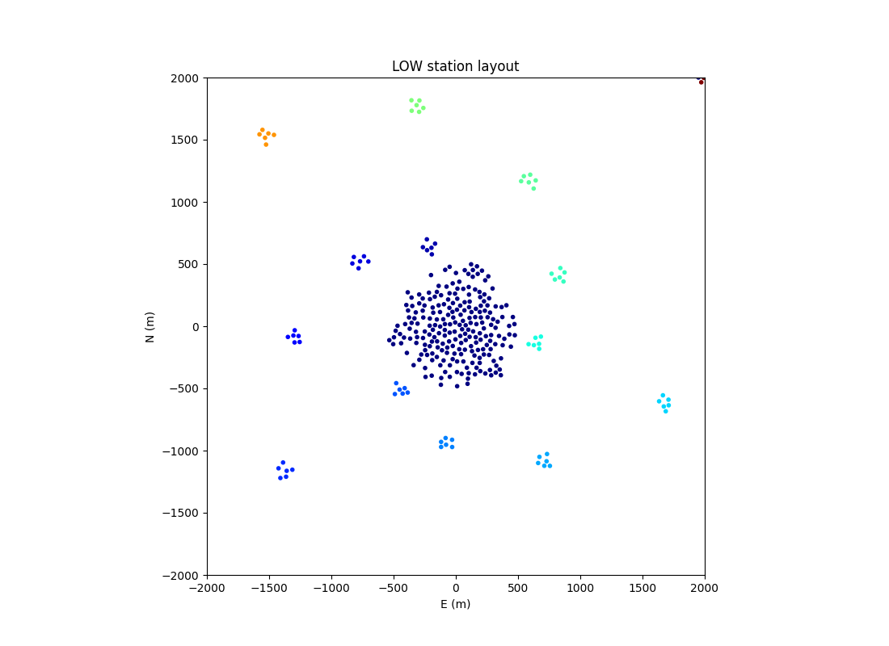

.. _ionospheric_calibration:

Ionospheric calibration
***********************

The ionospheric solver implemented in
:py:func:`ska_sdp_func_python.calibration.solve_ionosphere` fits low-order
functions to relative phase shifts across the array aperture. The relative
phase shifts are assumed to be proportional to the observed wavelength and
to arise from variations in Total Electron Content (TEC) for different paths
through the ionosphere. The solver is set up to use
Zernike polynomials in station position to model station-dependent
:math:`\Delta\mbox{TEC}` coefficients. As this parameterisation is independent
of wavelength, all frequency channels and baselines can be used together to
constrain a small number of parameters.

While SKA-Low is large relative to relevant structure in the ionosphere, the
clustered nature of stations in the array means that separate sets of
Zernike polynomials can be used to model the different clusters, with relative
shifts between clusters all contrained in a single global solver.

SKA-Low clusters
----------------

:py:func:`ska_sdp_func_python.calibration.solve_ionosphere` accepts a vector of
cluster IDs per station and fits a separate set of Zernike polynomials for all
stations with the same cluster ID. By default a single cluster will be
generated, however much of the testing has been done with a single cluster for
the inner core of stations and an additional cluster for each grouping of
six stations.

  Inner part of the SKA-Low layout showing station clusters

While the solver can accept a different and arbitrary set of basis functions
for each clusters, it is configured to use all Zernike polynomials with indices
:math:`n+|m| \leq 6` for cluster 0 (e.g. the SKA-Low core) and the first three
Zernike polynomials for all other cluster. A subset of these functions is
shown in the following figure. 

.. image:: ionospheric_calibration/zern.png
  :width: 500
  :alt: Low-order Zernike polynomials
  :align: center

The first three Zernike polynomials represent a global, wavelength-dependent
phase shift for the cluster (n=0, m=0), a wavelength-dependent northerly phase
gradient across the cluster (n=1, m=-1), and a wavelength-dependent easterly
phase gradient across the cluster (n=1, m=1).

Solving via normal equations
----------------------------

The visibility for stations *j* and *k* with an unknown ionospheric phase
perturbation is modelled as

.. math::

   m_{jk} = m_{jk}^\prime \, e^{-i 2 \pi \lambda 
       \left(\sum_p a_{f,p} f_p(x_j,y_j) -
             \sum_q a_{g,q} g_q(x_k,y_k)\right)}

where :math:`f_p(x,y)` is the :math:`p^{th}` Zernike polynomial at position
*x,y* within the cluster containing station *j*, :math:`g_q(x,y)` is the
:math:`q^{th}` polynomial for the cluster containing station *k*, and
:math:`m_{jk}^\prime` is the initial visibility model.
Free parameter :math:`a_{f,p}` is the fit solution for
polynomial :math:`f_p(x,y)`. When *j* and *k* are in the same cluster the
fit parameters are common, and the two first-order polynomials reduce to terms
that are proportional to the separation of stations, which in the plane of the
array are the *u,v* coordinates multiplied by wavelength. Thus the parameters
describe a :math:`\lambda^2`-dependent apparent angular shift for the sky
model, as seen by this cluster. Higher-order terms tend to decorrelate the
wavefront across the cluster.

As can be seen in the equation above, the unknown phase shifts are assumed to
be constant across the sky model. Known direction-dependent effects can be
incorporated into the model, but direction-dependent unknowns require multiple
calls to the function, for example from a peel loop.
The starting model, :math:`m_{jk}^\prime`, should include enough prior
information about the sky, the array and perhaps the ionosphere that the
unknowns are small and the exponential function can be linearised. For example,
the model could include calibration factors from an initial
direction-independent gain calibration step, or the model could be for an
intermediate step in an iterative process. Subtracting such a linearised model
from the observed visibilities leads to residuals of the form

.. math::

   r_{jk} = v_{jk} - m_{jk} \approx -
       i 2 \pi \lambda m_{jk} 
       \left(\sum_p a_{f,p} f_p(x_j,y_j) -
             \sum_q a_{g,q} g_q(x_k,y_k)\right)

Derivatives with respect to the free parameters,
-:math:`i 2 \pi \lambda m_{jk} f_p(x_j,y_j)` for :math:`a_{f,p}` and
:math:`i 2 \pi \lambda m_{jk} f_q(x_j,y_j)` for :math:`a_{g,q}`, can be added
to a design matrix, *A*, with a column for each parameter and a row for each
measurement, such that :math:`A \vec{a} = \vec{r}`, where :math:`\vec{a}` and
:math:`\vec{r}` are vectors containing the unknown parameters and the residual
visibilties, respectively. These can be solved via normal equations:

.. math::

   \vec{a} = (A^H A)^{-1} A^H \vec{r} \\

where superscript *H* represents the Hermitian transpose. Multiplication by
the complex conjugate model not only applies phase shifts and amplitude
weighting that is appropriate
for complicated calibration fields with multiple radio components and source
morphology, it also ensures that it is only the real part of :math:`\vec{a}`
that is relevant (although in the current solver implementation the factor *i*
is left out of *A* and it is the imaginary part of :math:`A^H \vec{r}` that
holds the information).

Baseline and/or wavelength dependent weights can also be incorporated
into the normal equations.
These could, for example, be used to apply a robust-style weighting and reduce
sidelobe confusion from unmodelled parts of the sky, to apply a taper during
the first iteration to down-weight long baselines and avoid phase wrapping
while the errors are larger, and/or to apply an inner taper to down-weight
short baselines and avoid unmodelled diffuse emission.

Further optimisations
---------------------

In general, Normal equations will be formed and solved several times in a
convergence loop, to reduce the effect of ignoring nonlinear terms. Since the
Normal matrix is approximately block diagonal, with a block for each set of
cluster parameters, we can also consider ignoring the small off-diagonal terms
and solve each block separately during each iteration of the convergence loop.
While this may require more iterations to converge, it avoids the rapid
scaling of both computational operations and memory as the total number of
parameters increases. While this has not yet been implemented for the solver
in this package, it would be a straightforward addition.

In more standard antenna-based calibration, using only the diagonal elements of
the Normal equations reduces them to the problem that is solved in a number of
other packages, such as ANTSOL and StefCAL.

